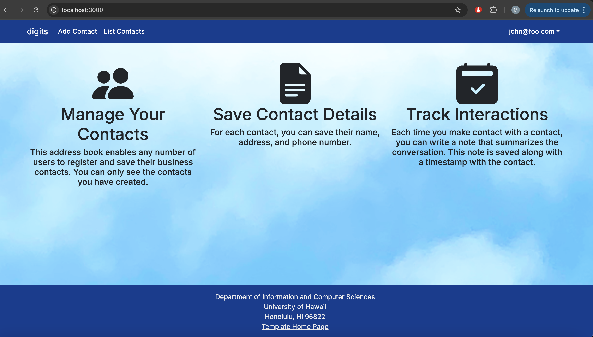

### Digits Management System



**Digits** is a contacts and notes management application I built. Users can log in securely, add new contacts with details like name, address, image, and description, and attach notes to each contact to track interactions or personal reminders.

Each user can only see and manage their own contacts and notes, but administrators can view all users and their contacts. The app uses modern technologies including **Next.js**, **Prisma ORM**, **PostgreSQL**, and **TypeScript**.

---

### Installation Instructions

**Clone the repository:**

```bash
git clone https://github.com/mateoMaramara/digits.git
cd digits
```
**Install dependencies:**

```bash
npm install
```
**Create a `.env` file** in the root directory and add the following:

```
DATABASE_URL=your_postgresql_database_url
NEXTAUTH_SECRET=your_nextauth_secret
NEXTAUTH_URL=http://localhost:3000
```
**Push schema and seed data:**

```bash
npx prisma migrate dev --name init
npx prisma db seed
```
**Start the development server:**

```bash
npm run dev
```
**Check for Errors using ESLint:**

```bash
npm run lint
```

Lastly, visit [http://localhost:3000](http://localhost:3000) to use the app.

---

### User Interface Walkthrough

#### Landing Page

Upon visiting the app, you are greeted with a landing page that introduces **Digits** and prompts you to sign in or register.

#### Register

If you don't yet have an account, you can click **Login** then **Sign Up** to register a new user.

#### Sign In

Clicking **Login** → **Sign In** allows you to log into the system with your credentials.

#### Home Page

Once logged in, the navigation bar will show links to **List Contacts**, **Add Contact**, and **Sign Out**. You are redirected to the homepage, which now includes options based on your access level.

#### Add Contact

Clicking on **Add Contact** allows you to input a new contact with first name, last name, address, image, and description.

#### List Contacts

Clicking **List Contacts** brings up all the contacts associated with your account. From here, you can:

- View contact information
- Add notes to each contact
- Edit contact details

#### Add Notes

Under each contact is a form where you can enter timestamped notes about your interactions or updates related to that contact.

#### Edit Contact

Each contact has an **Edit** link at the bottom that allows you to modify their information.

#### Admin View

If your user role is set to **ADMIN**, you will see an extra **Admin** link in the navbar. Clicking this shows all contacts across all users in the system.

---

### 📸 Screenshots

**Home Page:**


**Add Contact Page:**


**List Contact Page:**


**Add Note on Contact:**


**List Contact Page (with Notes):**


---

### 💻 Features

- 🔐 Secure login with NextAuth  
- 📇 Add, edit, and delete contacts  
- 📝 Attach timestamped notes to contacts  
- 🧑‍💼 Admin interface to view all users and contacts  
- 📱 Fully responsive with React Bootstrap  
